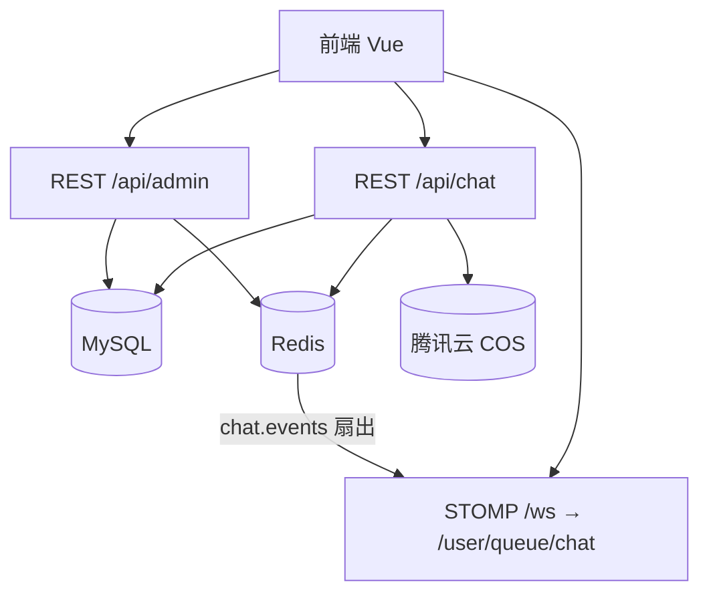

# 企业 IM 总结（P1–P4 完结）

本文档汇总 picture 项目中「企业 IM / 群聊」能力的最终形态，对应分册：`plan/chat_im_p1.md`～`plan/chat_im_p4.md`。

---

## 1. 用户能感知到什么

| 能力 | 说明 |
|------|------|
| 空间群聊 | 空间详情「群聊」Tab；VIEWER+ 可读可发；CREATOR 可删他人消息 |
| 私聊 | 用户资料「发消息」、空间成员「私聊」；同一对用户只有一个会话 |
| 消息中心 | 顶部「消息」入口；群与私聊混排；未读角标 |
| 实时 | 登录后全局 WebSocket，切 Tab / 看图不断连 |
| 文本与回复 | 单条 ≤500 字；支持回复引用 |
| 发图 | jpeg/png/gif/webp，≤10MB；可配文 |
| @ | 会话成员候选；被 @ 有站内通知并可深链进会话 |
| 治理 | 敏感词拦截；管理员维护词库与查看拦截日志 |

---

## 2. 四期路线图

| 期次 | 主题 | 结果 |
|------|------|------|
| **P1** | 地基 | 会话模型、未读水位、全局 WS、断线 `sinceId` 补洞、`clientMsgId` 幂等、Redis 扇出 |
| **P2** | 会话闭环 | get-or-create 私聊、列表填 `peer`/`title`、资料页与成员入口 |
| **P3** | 协作 | 发图（COS）、`@` + `CHAT_MENTION` 通知 |
| **P4** | 治理收官 | 敏感词拦截 + 审计日志 + `/admin` 管理台 |

路线图至此关闭。已读回执、搜索、发文件、机器人、置顶/免打扰等若再做，视为新需求。

---

## 3. 架构一览



### 存储分工

| 存储 | 用途 |
|------|------|
| **MySQL** | 会话、成员、消息、私聊 pair、@ 提及、敏感词、拦截审计 |
| **Redis** | `chat.events` 跨实例推送；敏感词缓存 `chat:sensitive:words`；登录 token（账号体系） |
| **COS** | 聊天图片文件（key 前缀 `chat/...`）；库中只存 `mediaUrl` |

WebSocket 只做实时推送，不持久化消息。

---

## 4. 核心数据模型

| 表 | 作用 |
|----|------|
| `conversation` | 会话壳；`type=SPACE\|DM`；SPACE 与 `spaceId` 1:1 |
| `conversation_member` | 成员 + `lastReadMessageId` 未读水位 |
| `chat_message` | 消息；`TEXT`/`IMAGE`；软删 |
| `conversation_dm_pair` | 私聊用户对唯一映射 `(userLowId, userHighId)` |
| `chat_message_mention` | @ 提及 |
| `sensitive_word` | 敏感词库 |
| `chat_moderation_log` | 拦截审计（BLOCK） |
| `notification` | 含 `CHAT_MENTION`、`conversationId` 深链 |

未读定义：他人消息且 `id > lastReadMessageId`。

删消息：DM 仅本人；SPACE 本人或 CREATOR。删敏感词用**物理删除**（避免 `uk_word` 占坑）。

---

## 5. 主要 API

### 聊天（登录）

- `GET /api/chat/conversations` — 会话列表  
- `GET /api/chat/conversations/by-space/{spaceId}` — 空间会话  
- `POST /api/chat/conversations/dm` — 开启/获取私聊 `{ peerUserId }`  
- `GET /api/chat/conversations/{id}/members` — @ 选人  
- `GET|POST /api/chat/conversations/{id}/messages` — 历史 / 发送（支持 `sinceId`、`mentionUserIds`）  
- `POST /api/chat/conversations/{id}/messages/image` — 发图  
- `PUT /api/chat/conversations/{id}/read` — 已读水位  
- `DELETE .../messages/{messageId}` — 删消息  

旧接口 `GET|POST /api/space/{id}/messages*` 仍可用，内部委托到 ChatService。

### 治理（`userRole=admin`）

- `GET|POST /api/admin/sensitive-words`  
- `PUT|DELETE /api/admin/sensitive-words/{id}`  
- `GET /api/admin/chat/moderation-logs`  

管理员：将某用户 `user.userRole` 改为 `admin` 后重新登录；前端 Header 出现「聊天治理」→ `/admin`。

### 实时事件

`MESSAGE_NEW` / `MESSAGE_DELETED` / `CONVERSATION_UPDATED` / `CONVERSATION_REMOVED`  
通道：登录连 `/ws?token=`，订 `/user/queue/chat`。

---

## 6. 前端入口

| 位置 | 能力 |
|------|------|
| `/messages`、`/messages/:id` | 会话列表与聊天室 |
| 空间详情「群聊」Tab | 同组件 `SpaceChatSection`，不断全局 WS |
| 用户资料 / 空间成员 | 发起私聊 |
| `/admin` | 敏感词 + 拦截日志（仅 admin） |
| 站内通知 | `CHAT_MENTION` → `/messages/{conversationId}` |

---

## 7. SQL 清单（按依赖）

```
sql/conversation.sql
sql/conversation_member.sql
sql/chat_message.sql
sql/migrate_space_chat_to_conversation.sql   # 旧 space_message 迁移（如有）
sql/conversation_dm_pair.sql                 # P2
sql/chat_message_p3.sql                      # P3 媒体字段
sql/chat_message_mention.sql
sql/notification_conversation_id.sql         # 若库中尚无 conversationId
sql/sensitive_word.sql                       # P4
sql/chat_moderation_log.sql
```

增量 `ALTER` 若报 Duplicate column，说明已执行过，跳过即可。

---

## 8. 代码位置

| 侧 | 路径 |
|----|------|
| 后端聊天 | `com.example.picturebackend.chat` |
| 后端治理 | `com.example.picturebackend.admin` |
| 前端 | `stores/chatStore.ts`、`pages/chat/*`、`components/SpaceChatSection.vue`、`pages/admin/*` |
| 约定 | `AGENTS.md`「企业 IM」小节 |

---

## 9. 明确不做（路线图外）

- 已读回执、「对方已读」  
- 会话内 / 全局搜索  
- 非图片文件、表情商店  
- 机器人、@所有人  
- 会话置顶 / 免打扰 / 删除会话  
- 图片 OCR / 自动封禁  
- 删消息同步删 COS  

---

*文档生成时：企业 IM 四期已全部落地，可作为后续维护与新人上手的总索引。*
