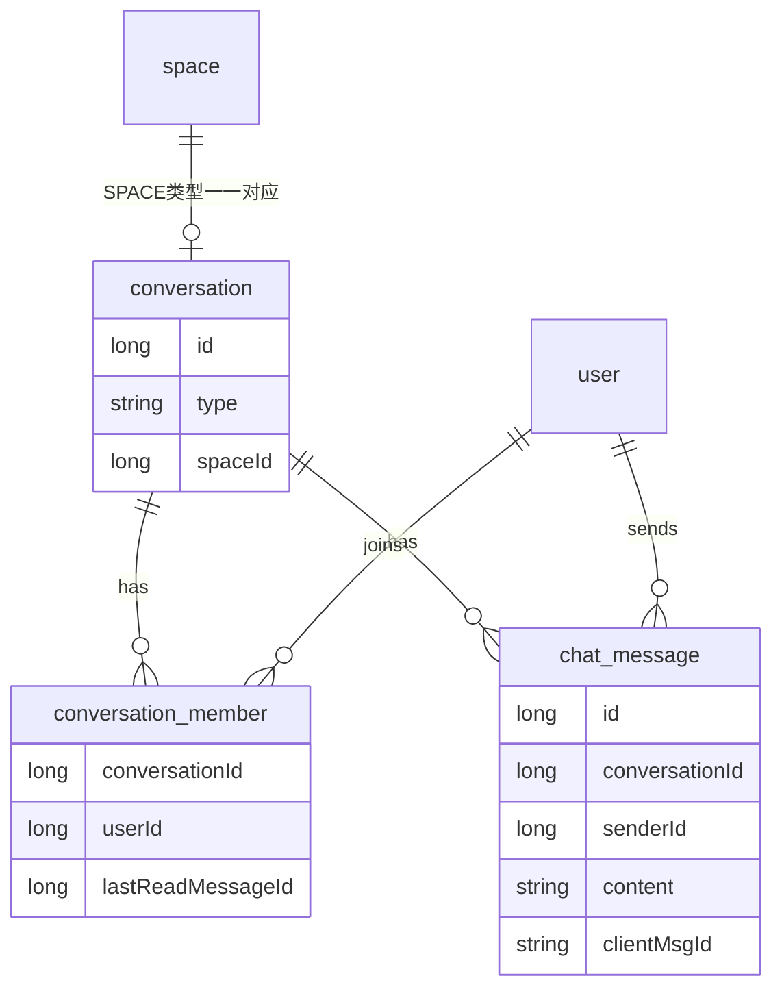
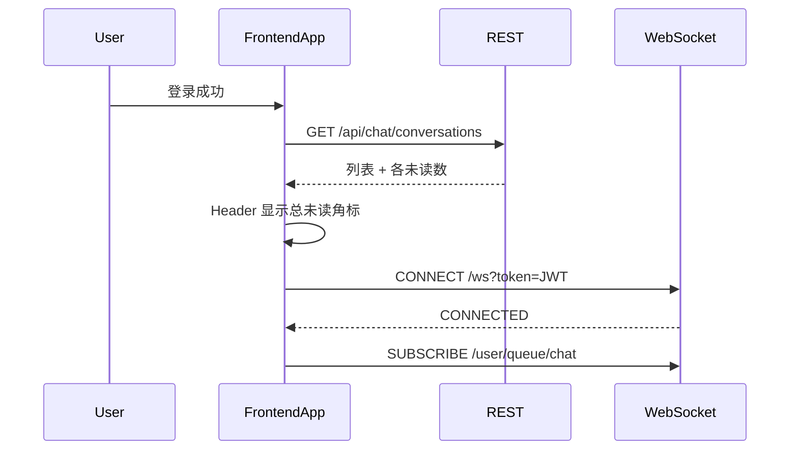
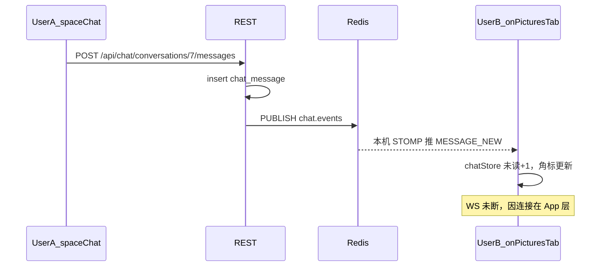

# 企业 IM 演进 — 第一期（地基）详细说明

## 0. 先用大白话说清「要变成什么样」

### 现在（MVP）

- 只有「空间里的一个群聊 Tab」
- 消息存在 `space_message`，靠 `spaceId` 区分
- 打开群聊才连 WebSocket，切到「图片」Tab 就断开
- 没有「未读数」，离开页面就不知道有人说话
- 推送只在**当前这一台**后端进程里有效（多开几台服务会丢消息）

### 第一期之后（地基打好）

可以把它想成「微信的骨架，但暂时只有群、还没有真正开私聊」：

1. **会话（conversation）**：统一容器。空间群是一种会话；以后私聊也是一种会话。消息不再直接挂在 `spaceId` 上，而是挂在 `conversationId` 上。
2. **消息列表页**：顶部导航有「消息」，能看到你加入的所有会话，以及每个会话的未读数。
3. **全局一条 WebSocket**：登录后一直连着；切 Tab、看图片也不会断。有人发消息，角标会变。
4. **断线能补洞**：网络闪断后，用「我本地最后一条消息的 id」向服务器要增量，避免丢消息或只靠整页刷新。
5. **重复发送不双条**：弱网点两次发送，用 `clientMsgId` 保证只落库一条。
6. **多台后端也能推到人**：用 Redis 广播事件，无论用户连在哪台机器都能收到。

### 还不会做的（避免期望错位）

- 还不能点头像「发起私聊」（表结构会预留，功能在 P2）
- 没有 @、已读回执、发图、搜索
- 不是拆成独立 IM 微服务，仍在本 Spring Boot 工程里加 `chat` 包

---

## 1. 总路线图（你选的 1C + 2A）

| 期次 | 主题 | 用户能感知到什么 |
|------|------|------------------|
| **P1（本期）** | 地基 | 有「消息」入口与未读角标；空间群聊切走不断连；断网重连不丢；多实例可推送 |
| P2 | 会话闭环 | 能发起私聊；会话列表里同时出现群和 DM |
| P3 | 协作 | @、已读、图片文件、搜索 |
| P4 | 治理 | 敏感词、审计、机器人 |

---

## 2. 核心概念图



**对照今天：**

| 今天 | P1 之后 |
|------|---------|
| `space_message.spaceId` | `chat_message.conversationId` |
| 隐式「在空间里就能聊」 | 必须是 `conversation_member` |
| 无未读 | `lastReadMessageId` 水位线 |
| 订 `/topic/space.{id}` | 订个人队列 `/user/queue/chat`（所有会话事件进这一条管子） |

---

## 3. 为什么第一期就要改表？（而不是继续在 space_message 上打补丁）

若只在现有群聊上加未读、保活，P2 做私聊时还要再迁一次模型，白干。  
所以 P1 **先引入会话抽象**，把现有空间群聊「搬进去」，私聊只差「创建一种 DM 会话」——表已经能装。

---

## 4. 端到端：用户日常会经历什么

### 4.1 登录后



### 4.2 人在「图片」Tab，别人发了群消息



B 点开「消息」或空间「群聊」时，再 `PUT .../read` 清未读。

### 4.3 断网重连补洞

1. 本地记住该会话最大消息 id，例如 `120`
2. WS 重连成功后：`GET .../messages?sinceId=120`
3. 服务器返回 `id > 120` 的消息（升序）
4. 前端合并进列表（按 id 去重）
5. 同时刷新会话列表，校正未读

### 4.4 手抖点两次发送

1. 前端每次发送生成 `clientMsgId = uuid`
2. 两次 POST 带同一 `clientMsgId`（或第二次重试同一 id）
3. 库上有 `uk(senderId, clientMsgId)`：第二次插入冲突 → 查出已有行 → **原样返回**，不新增第二条，也不重复刷屏（若已广播过则只返回 HTTP）

---

## 5. 数据层（详细）

### 5.1 `conversation`（会话）

| 列 | 含义 |
|----|------|
| `id` | 会话主键 |
| `type` | `SPACE` 或 `DM`（P1 业务只产生 SPACE） |
| `spaceId` | SPACE 时指向空间；DM 时为空 |
| 时间 / `isDelete` | 常规软删 |

约束：`SPACE` 时 `spaceId` 唯一 → **一个空间永远只有一个群会话**。

### 5.2 `conversation_member`（会话成员 + 已读水位）

| 列 | 含义 |
|----|------|
| `conversationId` + `userId` | 谁在这个会话里（唯一） |
| `lastReadMessageId` | 我读到哪条了；`0` 表示从没标已读 |
| `joinedAt` | 加入时间 |

**未读怎么算（P1 简单算法）：**

```text
未读数 = 该会话中满足：
  message.id > 我的 lastReadMessageId
  AND message.senderId != 我
  AND 未删除
的条数
```

打开会话并看到最新消息后：`PUT /read`，把 `lastReadMessageId` 设成当前最大消息 id。

### 5.3 `chat_message`（消息）

| 列 | 含义 |
|----|------|
| `conversationId` | 属于哪个会话 |
| `senderId` | 发送者 |
| `content` | 文本，仍 500 字 |
| `replyToId` | 单层回复 |
| `clientMsgId` | 可选；有则参与幂等 |

### 5.4 从旧表搬数据（迁移脚本要做的事）

对每个未删空间：

1. `INSERT conversation (type=SPACE, spaceId=...)`
2. 把该空间所有 `space_member` 插入 `conversation_member`（`lastReadMessageId=0`）
3. 把该空间所有 `space_message` 插入 `chat_message`（映射好 `conversationId`，`userId`→`senderId`）

之后**新数据**只写新表；旧 `/api/space/{id}/messages` 变成「查到 SPACE 会话再转调」，避免老客户端瞬间全挂。

### 5.5 和空间生命周期挂钩（否则成员会乱）

| 空间事件 | 会话侧动作 |
|----------|------------|
| 创建空间 | 建 SPACE 会话 + 创建者进 member |
| 同意邀请 | 被邀请人加入对应 conversation_member |
| 踢人 / 退出 | 物理删 conversation_member（同 uk 策略）+ 推 `CONVERSATION_REMOVED` |
| 解散空间 | 软删 conversation + 软删消息 + 清成员 |

---

## 6. REST API（详细）

包名：`com.example.picturebackend.chat`。

### 6.1 会话列表

`GET /api/chat/conversations?current=1&pageSize=20`

返回每条大致包含：

- `id`, `type`, `spaceId`, `spaceName`（SPACE 时）
- `lastMessage`：最后一条摘要（内容截断、发送者、时间）
- `unreadCount`
- `updateTime`（可按最后消息时间排序）

### 6.2 拉消息

`GET /api/chat/conversations/{id}/messages`

两种模式（同一接口用参数区分）：

| 参数 | 用途 |
|------|------|
| `current` + `pageSize` | 进会话时拉历史（与现在类似；建议仍 desc 再由前端倒序展示） |
| `sinceId` | 重连补洞：返回 `id > sinceId`，**升序**，可带 `limit` |

成员校验失败 → `NO_AUTH`。

### 6.3 发消息

`POST /api/chat/conversations/{id}/messages`

```json
{
  "content": "你好",
  "replyToId": null,
  "clientMsgId": "8f3c-..."
}
```

步骤：成员校验 → 幂等查询/插入 → 组装 VO → Redis 发布 `MESSAGE_NEW` → HTTP 返回 VO。

### 6.4 标记已读

`PUT /api/chat/conversations/{id}/read`

```json
{ "lastReadMessageId": 120 }
```

规则：只允许单调前进（新值 `<` 旧值则忽略或报错；选定：**忽略更小值**，避免乱序请求把水位打回去）。  
然后给该用户推 `CONVERSATION_UPDATED`（unreadCount 变为 0）。

### 6.5 删消息

逻辑同现在：SPACE 下本人或 CREATOR；软删后广播 `MESSAGE_DELETED`。

### 6.6 旧接口委托

保留：

- `GET|POST /api/space/{id}/messages`
- `DELETE /api/space/{id}/messages/{messageId}`

内部：`spaceId` → 查 SPACE 会话 → 调 ChatService。前端 P1 起改用 `/api/chat/**`。

---

## 7. WebSocket 与 Redis（详细）

### 7.1 和今天的差别

| | 今天 | P1 |
|--|------|-----|
| 谁负责连 | 群聊组件 | 登录后的 App 全局 |
| 订什么 | `/topic/space.{id}` | `/user/queue/chat` |
| 多实例 | 内存 broker，跨机丢 | Redis Pub/Sub 扇出 |

### 7.2 为什么改成「个人队列」？

企业 IM 常见做法：用户只订**自己的收件箱**。  
任意会话的新消息都推进这个收件箱，payload 里带 `conversationId`。  
好处：会话再多也不用订几十个 topic；未读刷新也能走同一通道。

Spring 用法简述：

1. 握手成功时把 `Principal` 设成 `userId` 字符串
2. 配置 `setUserDestinationPrefix("/user")`
3. 服务端：`convertAndSendToUser("42", "/queue/chat", event)`  
   客户端实际订阅：`/user/queue/chat`

### 7.3 Redis 扇出怎么工作

单机时也走同一路径（自己发、自己订），逻辑统一：

```text
ChatService 落库成功
  → redis.convertAndSend("chat.events", json)
  → 每台后端的 ChatRedisListener 收到
  → 解析出要通知的 memberUserIds
  → 对本机已连接用户 convertAndSendToUser(...)
```

用户连在 Node B、消息打在 Node A：A 只负责发 Redis；B 负责推给浏览器。

### 7.4 事件 JSON 约定

**MESSAGE_NEW**

```json
{
  "type": "MESSAGE_NEW",
  "conversationId": 7,
  "message": { "...SpaceMessageVO同级字段..." }
}
```

**MESSAGE_DELETED**

```json
{
  "type": "MESSAGE_DELETED",
  "conversationId": 7,
  "messageId": 120
}
```

**CONVERSATION_UPDATED**（未读变化、最后一条预览）

```json
{
  "type": "CONVERSATION_UPDATED",
  "conversationId": 7,
  "unreadCount": 3,
  "lastMessage": { "id": 121, "content": "...", "createTime": "..." }
}
```

**CONVERSATION_REMOVED**（被踢）

```json
{
  "type": "CONVERSATION_REMOVED",
  "conversationId": 7
}
```

---

## 8. 前端改造（详细）

项目：`picture-frontend`。

### 8.1 全局连接（解决你问过的「切 Tab 会不会断」）

- **现状**：`v-if="activeTab === 'chat'"` → 卸载组件 → `disconnect`
- **P1**：在 [`App.vue`](D:/code/picture/picture-frontend/src/App.vue)（或带 Header 的布局）里：`auth` 有 token 就 `connect`，登出才 `disconnect`
- 群聊 Tab **不再**负责建连；只从 `chatStore` 读当前会话消息并渲染

### 8.2 `chatStore`（Pinia）职责

- `conversations[]`、`unreadTotal`
- `messagesByConversationId`
- `handleEvent(event)`：更新列表 / 追加消息 / 删消息 / 减未读
- `fetchConversations`、`fetchMessages`、`sendMessage`、`markRead`、`syncSince(conversationId, sinceId)`

### 8.3 界面入口

1. [`AppHeader`](D:/code/picture/picture-frontend/src/components/AppHeader.vue)：铃铛旁增加「消息」+ 未读角标  
2. 新页面 `/messages`：会话列表（P1 全是空间群；可显示空间名）  
3. 点进某会话 → `/messages/:conversationId` 或仍进空间详情群聊 Tab（选定：**列表进独立会话页；空间详情 Tab 仍保留，两边共用组件**）  
4. [`SpaceChatSection`](D:/code/picture/picture-frontend/src/components/SpaceChatSection.vue)：props 改为 `conversationId`（或 spaceId 由页面先 resolve）；去掉内部 `useSpaceChat` 直连，改用 store

### 8.4 发送与已读

- 发送前：`clientMsgId = crypto.randomUUID()`
- 进入会话页 / 群聊 Tab 且窗口可见：对当前最大 id 调 `markRead`
- `document.visibilitychange` 回到前台：对活跃会话 `sinceId` 同步 + 刷新会话列表

---

## 9. 文件清单（实现时对照）

### 后端新建

- `sql/conversation.sql`、`conversation_member.sql`、`chat_message.sql`、`migrate_space_chat_to_conversation.sql`
- `chat/entity/*`、`mapper/*`、`service/*`、`controller/ChatController.java`
- `chat/model/dto|vo|converter/*`
- `chat/event/ChatEvent.java`、`ChatRedisListener.java`、`ChatEventPublisher.java`
- 调整 `websocket/*`：Principal、用户队列鉴权（可改名 `ChatHandshakeInterceptor`）

### 后端修改

- `SpaceServiceImpl`：创建 / 解散挂钩会话
- `SpaceInviteServiceImpl.accept`、成员踢出/退出：同步 member
- `SpaceMessageController`：委托 ChatService
- `WebSocketConfig`：user destination + 可选关闭仅 topic 订阅
- `AGENTS.md`

### 前端新建 / 修改

- `types/chat.ts`、`api/chat.ts`、`stores/chatStore.ts`、`composables/useChatSocket.ts`
- `pages/chat/ChatListPage.vue`、`ChatRoomPage.vue`（或等价）
- `App.vue`、`AppHeader.vue`、`router`、改造 `SpaceChatSection.vue`、`SpaceDetailPage.vue`
- `vite` 已有 `/ws` 代理可沿用

---

## 10. 实现顺序（建议严格按此）

1. **建表 + 迁移脚本**（本地库先跑通，确认条数对得上）  
2. **成员同步挂钩**（新建空间自动有会话；邀请/踢人/解散正确）  
3. **REST ChatService**（列表、发、删、read、sinceId、幂等）+ 旧 API 委托  
4. **Principal + 个人队列 + Redis 扇出**（先单机验收事件）  
5. **前端 store + 全局 WS + 角标 + 列表页**  
6. **改空间群聊 Tab 走新 API**  
7. **文档与验收清单**

---

## 11. 验收清单（人手测）

- [ ] 迁移后旧空间群历史还在  
- [ ] A、B 同空间；A 发，B 在图片 Tab 角标增加且回消息页能看到  
- [ ] B 打开会话后未读清零  
- [ ] 断网再连，B 能靠 sinceId 补上中间消息  
- [ ] 同一 clientMsgId 连点两次，库中仅一条  
- [ ] 踢人后被踢者收到 REMOVED，列表消失且不再收到新消息  
- [ ] （可选）两台后端进程 + 同一 Redis，B 连实例 2 仍能收 A 在实例 1 发的消息

---

## 12. P1 明确不做（再强调）

- 发起私聊 UI/API  
- @、已读回执、输入中、多媒体、搜索  
- RabbitMQ STOMP Relay、独立 IM 服务  
- 强制 disconnect 已连接 TCP（靠业务事件即可）
