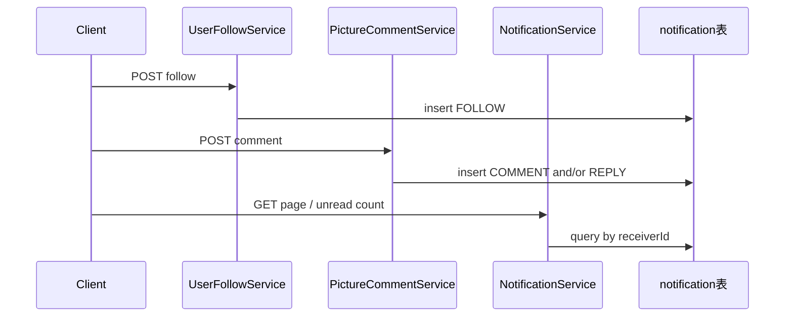

# 站内通知功能实现计划

## 选定方案

- **送达**：站内落库 + REST（列表 / 未读数 / 标已读），前端轮询；无 SSE/WebSocket
- **评论范围**：通知图片作者；若为回复，额外通知被回复评论作者；同一接收人只写一条；不通知自己

## 数据流

## 表结构

新增 [`sql/notification.sql`](../sql/notification.sql)：

- `id`：主键
- `receiverId`：接收者
- `senderId`：触发者
- `type`：`FOLLOW` / `COMMENT` / `REPLY`
- `pictureId`：评论相关可空；关注为 NULL
- `commentId`：评论/回复可空
- `content`：可选摘要（评论前 100 字）；关注可空
- `isRead`：0 未读 / 1 已读
- `createTime`：创建时间
- `isDelete`：逻辑删除

索引：`(receiverId, isRead, createTime)`、`(receiverId, createTime)`。列名 camelCase，与现有表一致。

## 包与代码

新建包 `com.example.picturebackend.notification`，对齐 `user` / `picture` 分层：

- `entity/Notification`、`mapper/NotificationMapper`
- `constant/NotificationType`（`FOLLOW` / `COMMENT` / `REPLY`）
- `service/NotificationService` + `impl`：`create(...)`、分页、未读数、单条已读、全部已读
- `model/vo/NotificationVO`：含 `type`、`isRead`、`createTime`、`sender`(UserVO)、`pictureId`、`commentId`、`content`
- `controller/NotificationController`，前缀 `/api/notification`

## 写入时机（业务钩子）

1. **关注** — [`UserFollowServiceImpl.follow`](../src/main/java/com/example/picturebackend/user/service/impl/UserFollowServiceImpl.java)：关注成功（含 soft-delete restore）后，向 `followedId` 写 `FOLLOW`（`senderId = followerId`）。
2. **评论** — [`PictureCommentServiceImpl.addComment`](../src/main/java/com/example/picturebackend/picture/service/impl/PictureCommentServiceImpl.java)：插入成功后：
   - 若 `userId != picture.userId` → 向图片作者写 `COMMENT`（带 `pictureId`、`commentId`、内容摘要）
   - 若存在 `parent` 且 `userId != parent.userId` → 向父评论作者写 `REPLY`
   - 若图片作者与父评论作者为同一人，只写一条（优先 `REPLY`，因语义更具体）

通知写入与业务同事务（`@Transactional` 已有），失败随业务回滚。取消关注、删评论不删历史通知。

## API（均需登录，走现有 AuthInterceptor）

- `GET /api/notification/page`：分页，按 `createTime` 倒序；`PageRequest`
- `GET /api/notification/unread/count`：未读数量
- `PUT /api/notification/{id}/read`：标单条已读（仅本人）
- `PUT /api/notification/read/all`：全部已读

列表 VO 批量填充 `sender`（同评论列表的 `UserConverter` 模式）。

## 实现任务

1. 新增 `sql/notification.sql` 建表脚本
2. 实现 `notification` 包：entity / mapper / service / converter / VO / controller
3. 在关注成功与发表评论后写入通知（去重、跳过自己）
4. 更新 `AGENTS.md` 通知约定

## 文档

在 [`AGENTS.md`](../AGENTS.md) 增加 Notification 小节：表约定、类型、接口与「不通知自己 / 同接收人去重」规则。

## 不在本次范围

推送、WebSocket/SSE、邮箱/短信、通知偏好设置。
