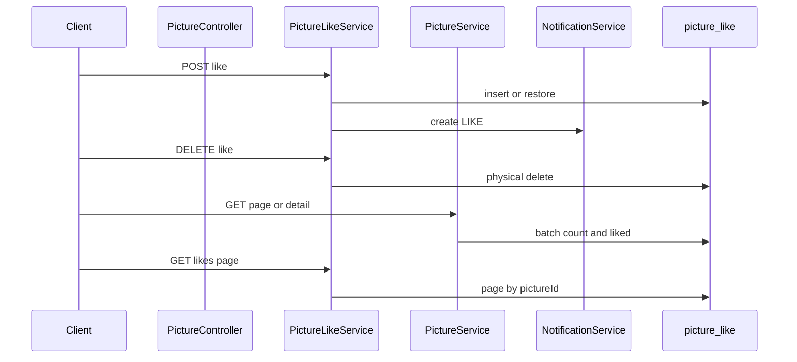

# 公共图库图片点赞实现计划

## 选定方案

- **模型**：独立关系表 `picture_like`，对齐 `user_follow`（唯一索引 + 取消时物理删除）
- **规则**：禁止给自己的图片点赞；点赞成功后通知图片作者（`LIKE`）；取消点赞不删历史通知；不通知自己
- **展示**：公共列表/详情返回 `likeCount`、`liked`（未登录 `liked=false`）；另提供点赞用户分页列表
- **不在本次**：按点赞数排序、点赞数冗余列、SSE/WebSocket

## 数据流

## 表结构

新增 [`sql/picture_like.sql`](../sql/picture_like.sql)：

- `id`：主键
- `userId`：点赞用户
- `pictureId`：被赞图片
- `createTime`：创建时间
- `isDelete`：逻辑删除字段（实体带 `@TableLogic`；取消赞走物理删除）

索引：`UNIQUE uk_user_picture (userId, pictureId)`，`idx_pictureId`，`idx_userId`。列名 camelCase，与现有表一致。

Mapper 自定义 SQL：`deletePhysically`、`restoreSoftDeleted`（兼容历史软删残留）。

## 包与代码

落在现有 `picture` 包：

- `entity/PictureLike`、`mapper/PictureLikeMapper`
- `service/PictureLikeService` + `impl`：`like` / `unlike` / `isLiked` / `countByPictureId` / `countByPictureIds` / `findLikedPictureIds` / `pageLikers`
- `PictureVO` 增加 `likeCount`、`liked`
- `NotificationType.LIKE`
- API 挂在 `PictureController`

`PictureServiceImpl` 在列表/详情/上传/更新返回 VO 时填充点赞字段。

## 写入时机（业务钩子）

**点赞** — `PictureLikeServiceImpl.like`：校验图片存在、禁止自赞、未重复点赞后 insert（或 restore），向图片作者写 `LIKE`（`pictureId` 有值，`commentId`/`content` 为空）。

通知与业务同事务；取消点赞不删历史通知。

## API

| 方法 | 路径 | 鉴权 | 返回 |
|------|------|------|------|
| `POST` | `/api/picture/{id}/like` | 必登录 | `Void` |
| `DELETE` | `/api/picture/{id}/like` | 必登录 | `Void` |
| `GET` | `/api/picture/{id}/like/status` | 可选登录 | `Boolean`（未登录 `false`） |
| `GET` | `/api/picture/{id}/likes` | 公开 | `IPage<UserVO>` |

公开 `GET /api/picture/page`、`GET /api/picture/{id}` 经 `OptionalAuthInterceptor`，有 token 时填 `liked`。

## 实现任务

1. 新增 `sql/picture_like.sql` 建表脚本
2. 实现 entity / mapper / service；扩展 `NotificationType`、`PictureVO`、`PictureService`
3. Controller 端点 + `WebMvcConfig` 鉴权
4. 更新 `AGENTS.md` 点赞约定

## 文档

在 [`AGENTS.md`](../AGENTS.md) 增加 Picture Like 小节。

## 不在本次范围

按点赞数排序、点赞数冗余列、推送、WebSocket/SSE。
