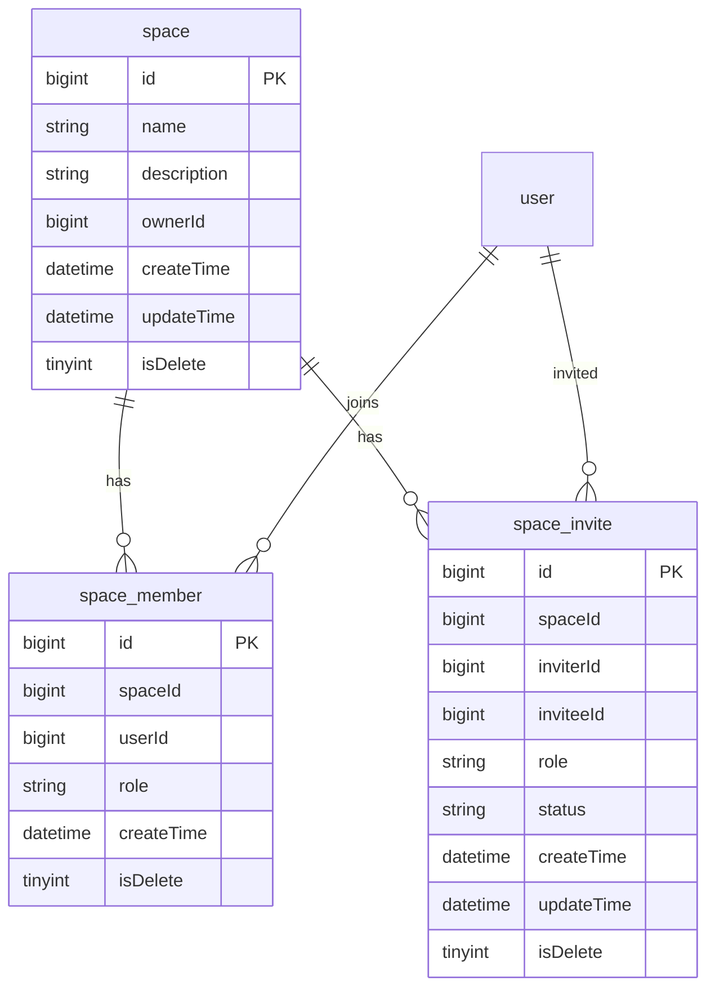
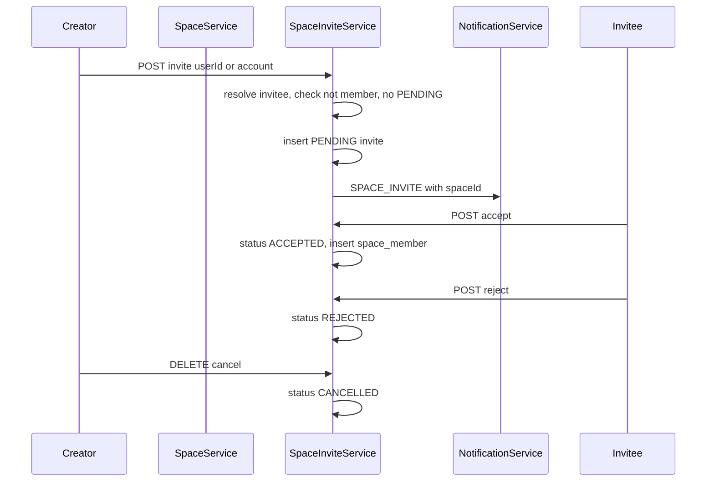

# 团队空间（成员体系）实现计划

## 选定方案

- **范围**：仅空间 + 邀请 + 成员角色；图片仍属个人，`picture` 不加 `spaceId`
- **角色**：`CREATOR`（创建者，唯一）、`EDITOR`、`VIEWER`；权限矩阵待定，本阶段只存角色、做成员管理鉴权
- **邀请**：创建者发起，被邀请人同意后才入成员表；请求体支持 `userId` 或 `userAccount`（二选一，都传时以 `userId` 为准）
- **通知**：新增 `SPACE_INVITE`；`notification` 表增加可空 `spaceId` 供深链
- **不在本次**：角色对图片/空间资源的细粒度操作、转让创建者、空间内图库

## 数据模型

新增 SQL：

- [`sql/space.sql`](../sql/space.sql)：`space`（`name`、`description`、`ownerId` 冗余便于校验）
- [`sql/space_member.sql`](../sql/space_member.sql)：仅已加入成员；`UNIQUE uk_space_user (spaceId, userId)`；退出/踢出用**物理删除**（对齐关注/点赞，避免唯一索引被软删占用）
- [`sql/space_invite.sql`](../sql/space_invite.sql)：`status` = `PENDING` / `ACCEPTED` / `REJECTED` / `CANCELLED`；邀请角色仅 `EDITOR` | `VIEWER`；应用层保证同一 `(spaceId, inviteeId)` 至多一条 `PENDING`；终态保留历史（不占唯一索引）
- 变更 [`sql/notification.sql`](../sql/notification.sql) 或增量脚本：`ALTER` 增加 `spaceId BIGINT NULL`

创建空间时同事务：写 `space` + 插入创建者 `space_member(role=CREATOR)`。

## 邀请流程

规则：

- 不能邀请自己；不能邀请已是成员；已有 `PENDING` 则报错
- 接受时写入 `space_member`（角色取邀请上的 `role`），与邀请状态更新同事务
- 拒绝 / 取消不写成员；不删历史通知
- 仅创建者可邀请、取消、改角色、踢人；成员可自行退出（创建者不可退出，需先解散空间）

## 包与代码

新建包 `com.example.picturebackend.space`，对齐 `user` / `notification`：

- `constant/SpaceRole`：`CREATOR` / `EDITOR` / `VIEWER`
- `constant/SpaceInviteStatus`：`PENDING` / `ACCEPTED` / `REJECTED` / `CANCELLED`
- `entity`：`Space`、`SpaceMember`、`SpaceInvite`
- `mapper` + 成员物理删除自定义 SQL（同 `UserFollowMapper.deletePhysically`）
- `service`：`SpaceService`（创建/更新/解散/我的空间/详情）、`SpaceMemberService`（列表/改角色/踢人/退出）、`SpaceInviteService`（邀请/接受/拒绝/取消/待处理列表）
- `model/dto`：创建/更新空间、邀请请求（`userId`、`userAccount`、`role`）
- `model/vo`：`SpaceVO`、`SpaceMemberVO`（含 `UserVO` + `role`）、`SpaceInviteVO`
- `controller/SpaceController`，前缀 `/api/space`

扩展：

- [`NotificationType`](../src/main/java/com/example/picturebackend/notification/constant/NotificationType.java) 增加 `SPACE_INVITE`
- [`Notification`](../src/main/java/com/example/picturebackend/notification/entity/Notification.java) / VO / `create(...)` 增加 `spaceId`
- [`WebMvcConfig`](../src/main/java/com/example/picturebackend/config/WebMvcConfig.java)：空间相关接口均需登录（走现有 `AuthInterceptor`，无需新 exclude）

## API（均需登录）

| 方法 | 路径 | 说明 |
|------|------|------|
| `POST` | `/api/space` | 创建空间 |
| `GET` | `/api/space/my` | 我加入的空间分页 |
| `GET` | `/api/space/{id}` | 空间详情（须为成员） |
| `PUT` | `/api/space/{id}` | 更新名称/简介（仅创建者） |
| `DELETE` | `/api/space/{id}` | 解散（仅创建者；软删 space，物理清成员与 PENDING 邀请） |
| `GET` | `/api/space/{id}/members` | 成员分页 |
| `PUT` | `/api/space/{id}/members/{userId}/role` | 改角色（仅创建者；目标不能是创建者；仅 EDITOR/VIEWER） |
| `DELETE` | `/api/space/{id}/members/{userId}` | 踢人（仅创建者；不能踢创建者） |
| `DELETE` | `/api/space/{id}/members/me` | 退出（非创建者） |
| `POST` | `/api/space/{id}/invites` | 邀请（body：`userId` 或 `userAccount` + `role`） |
| `GET` | `/api/space/{id}/invites` | 空间待处理邀请（仅创建者） |
| `GET` | `/api/space/invites/pending` | 我收到的待处理邀请 |
| `POST` | `/api/space/invites/{inviteId}/accept` | 同意 |
| `POST` | `/api/space/invites/{inviteId}/reject` | 拒绝 |
| `DELETE` | `/api/space/invites/{inviteId}` | 取消（仅邀请人或创建者） |

角色权限矩阵（对资源的增删改查）明确**不实现**；仅上述成员管理接口做「是否创建者 / 是否成员」校验。

## 实现任务

1. 新增 `sql/space.sql`、`sql/space_member.sql`、`sql/space_invite.sql`；`notification` 增加 `spaceId`
2. 实现 `space` 包：entity / mapper / constant / dto / vo / service / controller
3. 实现邀请解析（`userId` | `userAccount`）、接受入会、拒绝/取消与通知 `SPACE_INVITE`
4. 实现成员列表、改角色、踢人、退出、解散（物理删成员/待邀请）
5. 扩展 `NotificationType` / entity / `create` / VO 支持 `spaceId`
6. 更新 `AGENTS.md` Team Space 约定

## 文档

在 [`AGENTS.md`](../AGENTS.md) 增加 Team Space 小节：表约定、角色、邀请规则、物理删除、通知类型与接口列表。

## 不在本次范围

角色权限矩阵、转让创建者、图片绑定空间、空间内图库。
