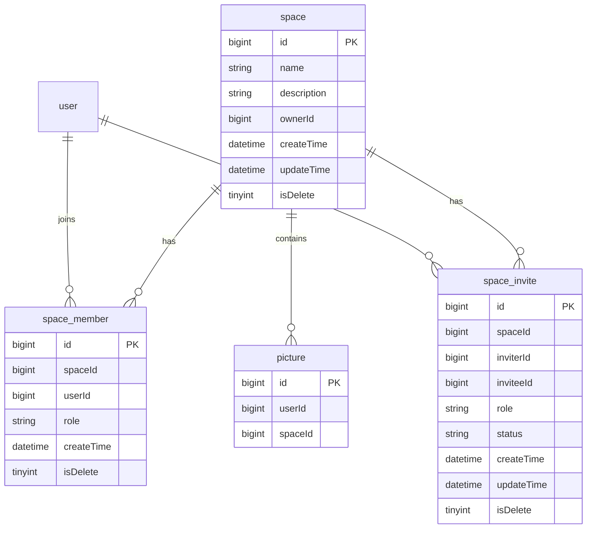

# 团队空间（成员体系 + 图片权限）实现计划

## 选定方案

- **范围**：空间 + 邀请 + 成员角色 + 空间图片权限矩阵
- **角色**：`CREATOR`（创建者，唯一）、`EDITOR`、`VIEWER`
- **图片**：`picture.spaceId` 可空；`NULL` = 个人图（公开图库）；非空 = 空间图（成员可见）
- **邀请**：创建者发起，被邀请人同意后才入成员表；请求体支持 `userId` 或 `userAccount`（二选一，都传时以 `userId` 为准）
- **通知**：`SPACE_INVITE`；`notification.spaceId` 可空供深链
- **不在本次**：转让创建者、编辑者删图、空间图进公共流

## 权限矩阵

| 操作 | 个人图 (`spaceId=null`) | VIEWER | EDITOR | CREATOR |
|------|-------------------------|--------|--------|---------|
| 浏览列表/详情 | 公开 | 是 | 是 | 是 |
| 上传 | 任意登录用户 | 否 | 是 | 是 |
| 编辑信息（name/description） | 仅上传者 | 否 | 是 | 是 |
| 删除 | 仅上传者 | 否 | 否 | 是 |
| 成员/邀请/解散等 | — | 否 | 否 | 是 |

空间图点赞/评论须 VIEWER+。校验：`SpaceService.requireRoleAtLeast` + `SpaceRole.atLeast`。

## 数据模型

SQL：

- [`sql/space.sql`](../sql/space.sql)、[`sql/space_member.sql`](../sql/space_member.sql)、[`sql/space_invite.sql`](../sql/space_invite.sql)
- [`sql/picture.sql`](../sql/picture.sql) / [`sql/picture_space_id.sql`](../sql/picture_space_id.sql)：`spaceId BIGINT NULL`
- [`sql/notification.sql`](../sql/notification.sql) / [`sql/notification_space_id.sql`](../sql/notification_space_id.sql)：`spaceId`

创建空间时同事务：写 `space` + 插入创建者 `space_member(role=CREATOR)`。  
解散：软删 `space`，物理清成员与 `PENDING` 邀请，软删该空间图片。

## 图片 API

| 方法 | 路径 | 说明 |
|------|------|------|
| `POST` | `/api/picture/upload` | 可选 `spaceId`；有则需 EDITOR+ |
| `GET` | `/api/picture/page` | 仅个人图 |
| `GET` | `/api/picture/my/page` | 本人上传（可含空间图） |
| `GET` | `/api/space/{id}/pictures` | 空间图分页，VIEWER+ |
| `GET` | `/api/picture/{id}` | 空间图需 VIEWER+ |
| `PUT` | `/api/picture/update` | 个人=上传者；空间=EDITOR+ |
| `DELETE` | `/api/picture/delete/{id}` | 个人=上传者；空间=CREATOR |

## 空间成员 API（均需登录）

| 方法 | 路径 | 说明 |
|------|------|------|
| `POST` | `/api/space` | 创建空间 |
| `GET` | `/api/space/my` | 我加入的空间分页 |
| `GET` | `/api/space/{id}` | 空间详情（须为成员） |
| `PUT` | `/api/space/{id}` | 更新名称/简介（仅创建者） |
| `DELETE` | `/api/space/{id}` | 解散（仅创建者） |
| `GET` | `/api/space/{id}/members` | 成员分页 |
| `PUT` | `/api/space/{id}/members/{userId}/role` | 改角色（仅创建者） |
| `DELETE` | `/api/space/{id}/members/{userId}` | 踢人（仅创建者） |
| `DELETE` | `/api/space/{id}/members/me` | 退出（非创建者） |
| `POST` | `/api/space/{id}/invites` | 邀请 |
| `GET` | `/api/space/{id}/invites` | 空间待处理邀请（仅创建者） |
| `GET` | `/api/space/invites/pending` | 我收到的待处理邀请 |
| `POST` | `/api/space/invites/{inviteId}/accept` | 同意 |
| `POST` | `/api/space/invites/{inviteId}/reject` | 拒绝 |
| `DELETE` | `/api/space/invites/{inviteId}` | 取消 |

## 文档

[`AGENTS.md`](../AGENTS.md) Team Space / Picture 约定含权限矩阵与接口列表。
