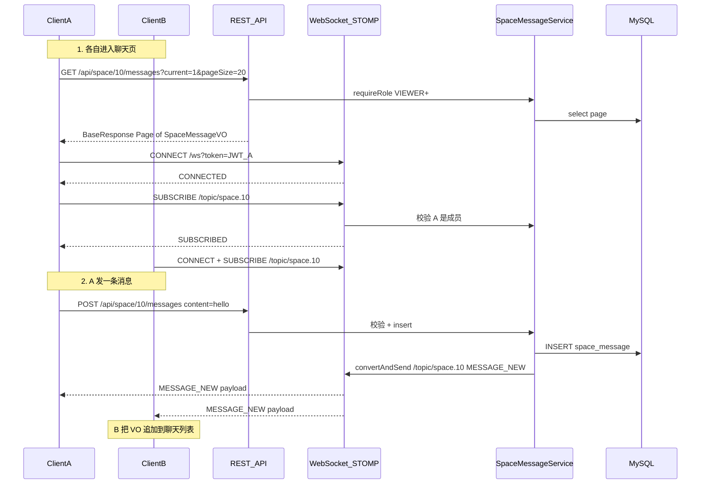

# 团队空间群聊系统（详细实现说明）

## 1. 用一句话说清怎么做

**每个空间 = 一个聊天室。** 消息存在 MySQL 表 `space_message` 里。

前端做两件事：

1. **HTTP（和现有接口一样）**：进聊天页时 `GET` 拉历史；发消息 `POST`；删消息 `DELETE`。这些接口负责**真正写入数据库**。
2. **WebSocket（新增）**：登录后连上 `/ws`，再订阅本空间的频道。别人发/删消息时，服务端往这个频道**推一条事件**，前端不用刷新就能更新界面。

可以把它想成：

- REST = 记账本（权威数据）
- WebSocket = 广播喇叭（告诉在线成员「账本刚变了」）

**为什么不把发消息也放进 WebSocket？** 本项目现有业务全是 REST + JWT Header；写操作继续走 REST，错误码、事务、鉴权和评论/点赞一致，实现更稳。WebSocket 只负责推送。

---

## 2. 选定范围

| 要做 | 不做 |
|------|------|
| 纯文本（最长 500 字） | @提及、站内通知 |
| 回复某条（`replyToId`，单层引用） | 聊天里上传图片 / 引用 pictureId |
| 自己删自己的；创建者可删任意 | 已读水位、未读角标 |
| 成员实时收到新消息/删除事件 | 踢人后强制断开已有 WS（v1 接受重连后失败） |
| 解散空间时软删该空间全部消息 | RabbitMQ 消息总线 |

权限：

| 操作 | VIEWER | EDITOR | CREATOR |
|------|--------|--------|---------|
| 拉历史 / 订阅读频道 | 是 | 是 | 是 |
| 发消息 | 是 | 是 | 是 |
| 删自己的 | 是 | 是 | 是 |
| 删别人的 | 否 | 否 | 是 |

校验一律调用现有 [`SpaceService.requireRoleAtLeast(spaceId, userId, SpaceRole.VIEWER)`](../src/main/java/com/example/picturebackend/space/service/SpaceService.java)（删别人的再额外判断角色是否为 CREATOR）。

---

## 3. 端到端：用户打开聊天到收到别人消息

假设用户 A、B 都是空间 `spaceId=10` 的成员。



删消息同理：`DELETE` 成功后广播 `MESSAGE_DELETED`，双方从列表移除或标删除。

---

## 4. 数据层

### 4.1 表结构 [`sql/space_message.sql`](../sql/space_message.sql)

```sql
CREATE TABLE IF NOT EXISTS `space_message` (
    `id`         BIGINT       NOT NULL AUTO_INCREMENT,
    `spaceId`    BIGINT       NOT NULL,
    `userId`     BIGINT       NOT NULL,
    `content`    VARCHAR(500) NOT NULL,
    `replyToId`  BIGINT       NULL COMMENT '回复的消息ID，可空',
    `createTime` DATETIME     NOT NULL DEFAULT CURRENT_TIMESTAMP,
    `updateTime` DATETIME     NOT NULL DEFAULT CURRENT_TIMESTAMP ON UPDATE CURRENT_TIMESTAMP,
    `isDelete`   TINYINT      NOT NULL DEFAULT 0,
    PRIMARY KEY (`id`),
    KEY `idx_space_createTime` (`spaceId`, `createTime`)
) ENGINE=InnoDB DEFAULT CHARSET=utf8mb4;
```

- 一空间多消息，靠 `spaceId` 隔离；**没有**单独的「会话表」——空间本身就是会话。
- 删除用 `@TableLogic` 软删（与评论一致），不是物理删。
- `replyToId`：只存父消息 id；展示时再查父消息拼摘要。

### 4.2 实体 / Mapper

- [`SpaceMessage.java`](../src/main/java/com/example/picturebackend/space/entity/SpaceMessage.java)：字段与表一一对应
- [`SpaceMessageMapper.java`](../src/main/java/com/example/picturebackend/space/mapper/SpaceMessageMapper.java)：`BaseMapper<SpaceMessage>` 即可

---

## 5. REST 接口（写权威数据）

控制器：新建 [`SpaceMessageController`](../src/main/java/com/example/picturebackend/space/controller/SpaceMessageController.java)，风格抄 [`SpaceController`](../src/main/java/com/example/picturebackend/space/controller/SpaceController.java)：

- 从 `HttpServletRequest` 取 `UserConstant.CURRENT_USER_ID_ATTR`（全局 `AuthInterceptor` 已拦 `/api/**`）
- 返回 `BaseResponse` + `ResultUtils.success`

### 5.1 拉历史

`GET /api/space/{id}/messages?current=1&pageSize=20`

Service 步骤：

1. `requireRoleAtLeast(spaceId, userId, VIEWER)`
2. `Page` 查询：`eq(spaceId).orderByDesc(createTime)`
3. 批量查发送者 → `UserVO`
4. 收集本页所有非空 `replyToId`，批量查父消息（含已软删的可用自定义查询，或二次组装时标 deleted）
5. 组装 `SpaceMessageVO` 列表返回

响应形状（示意）：

```json
{
  "code": 0,
  "data": {
    "records": [
      {
        "id": 101,
        "spaceId": 10,
        "content": "你好",
        "createTime": "2026-07-12T21:00:00",
        "sender": { "id": 1, "userName": "A", "userAvatar": "..." },
        "replyTo": null
      },
      {
        "id": 102,
        "spaceId": 10,
        "content": "收到",
        "createTime": "2026-07-12T21:01:00",
        "sender": { "id": 2, "userName": "B", "userAvatar": "..." },
        "replyTo": {
          "id": 101,
          "content": "你好",
          "deleted": false,
          "sender": { "id": 1, "userName": "A", "userAvatar": "..." }
        }
      }
    ],
    "total": 2,
    "current": 1,
    "size": 20
  }
}
```

前端聊天 UI 一般倒序展示：可用 `records` 反转，或后续再加 `asc` 参数；**本期按现有分页习惯 `orderByDesc`，前端自行倒转即可。**

### 5.2 发消息

`POST /api/space/{id}/messages`

Request body：

```json
{ "content": "收到", "replyToId": 101 }
```

`replyToId` 可省略或 `null`。

Service 步骤（`@Transactional`）：

1. `requireRoleAtLeast(spaceId, userId, VIEWER)`
2. 校验 `content` 非空、trim 后长度 ≤ 500
3. 若有 `replyToId`：查出父消息，必须 `spaceId` 相同且未删除，否则 `PARAMS_ERROR`
4. `insert` 新行
5. 转成 `SpaceMessageVO`（含 sender、replyTo）
6. **广播**（见第 6 节）：`SimpMessagingTemplate.convertAndSend("/topic/space." + spaceId, event)`
7. 把 VO 作为 HTTP 响应返回（发送者自己也能用响应更新 UI；广播给自己多一次可忽略或前端去重按 `id`）

### 5.3 删消息

`DELETE /api/space/{id}/messages/{messageId}`

Service 步骤：

1. 查消息：必须存在、`spaceId` 匹配路径 id、未删
2. `requireRoleAtLeast(spaceId, operatorId, VIEWER)`（保证还是成员）
3. 权限：`operatorId == message.userId` **或** 成员角色是 `CREATOR`，否则 `NO_AUTH`
4. `deleteById`（逻辑删）
5. 广播 `MESSAGE_DELETED`：`{ "type":"MESSAGE_DELETED", "spaceId":10, "messageId":101 }`
6. HTTP 返回 `success(null)`

**不级联**：别人回复过这条的消息仍在；列表组装时若父已删，则 `replyTo.deleted=true`，`content` 可为空或固定「消息已删除」。

### 5.4 解散空间联动

改 [`SpaceServiceImpl.dissolveSpace`](../src/main/java/com/example/picturebackend/space/service/impl/SpaceServiceImpl.java)：在软删空间、清成员/邀请、软删图片之后（或同事务内）增加：

```java
spaceMessageMapper.delete(new LambdaQueryWrapper<SpaceMessage>()
    .eq(SpaceMessage::getSpaceId, spaceId));
```

（MyBatis-Plus `@TableLogic` 的 `delete` = 软删。）

---

## 6. WebSocket 怎么实现（重点）

### 6.1 依赖

[`pom.xml`](../pom.xml) 增加：

```xml
<dependency>
  <groupId>org.springframework.boot</groupId>
  <artifactId>spring-boot-starter-websocket</artifactId>
</dependency>
```

### 6.2 协议：WebSocket 上跑 STOMP

浏览器原生 WebSocket 只是字节管道。Spring 常用 **STOMP**（像「带主题的订阅协议」）架在 WebSocket 上：

| 概念 | 本项目取值 | 作用 |
|------|------------|------|
| 连接地址 | `ws://host/ws?token=...` | 建立长连接并鉴权 |
| 订阅目的地 | `/topic/space.{spaceId}` | 收该空间广播 |
| 服务端推送 | `SimpMessagingTemplate.convertAndSend(...)` | 往目的地发 JSON |

前端一般用 `@stomp/stompjs` 或 `sockjs`+stomp；后端用 Spring 的 STOMP 支持即可。本期 **不启用 SockJS**（直接原生 WebSocket），除非前端环境必须兼容旧浏览器——默认原生。

### 6.3 配置类 [`WebSocketConfig`](../src/main/java/com/example/picturebackend/config/WebSocketConfig.java)

实现 `WebSocketMessageBrokerConfigurer`：

```text
registerStompEndpoints:
  - path: /ws
  - addInterceptors(SpaceChatHandshakeInterceptor)
  - setAllowedOriginPatterns("*")   // 与现有 CORS 一致

configureMessageBroker:
  - enableSimpleBroker("/topic")    // 内存广播，单机足够
  - setApplicationDestinationPrefixes("/app")  // 预留；本期客户端不往 /app 发消息
```

**注意**：HTTP 的 `AuthInterceptor` **拦不到** WebSocket 握手；鉴权必须另做（下面两层）。

### 6.4 第一层鉴权：握手 [`SpaceChatHandshakeInterceptor`](../src/main/java/com/example/picturebackend/websocket/SpaceChatHandshakeInterceptor.java)

浏览器 WebSocket **不能方便地设自定义 Header**（和 fetch 不同），所以 JWT 放在 query：

```text
ws://localhost:8080/ws?token=eyJhbGciOi...
```

`beforeHandshake` 逻辑（对齐 [`AuthTokenResolver`](../src/main/java/com/example/picturebackend/interceptor/AuthTokenResolver.java)）：

1. 读 `token` 查询参数
2. Redis 黑名单检查
3. `JwtUtils.getUserId/getRole`
4. Redis `LOGIN_USER_KEY_PREFIX + userId` 必须等于该 token（单点登录）
5. 失败 → `return false`（握手拒绝）
6. 成功 → `attributes.put("userId", userId)`，供后续 Channel 使用

可抽一个 `AuthTokenResolver.resolveToken(String token)` 给 HTTP Header 与 WS query 共用，避免复制粘贴。

### 6.5 第二层鉴权：订阅 [`SpaceChatChannelInterceptor`](../src/main/java/com/example/picturebackend/websocket/SpaceChatChannelInterceptor.java)

只连上 `/ws` 还不够——必须防止「非成员订阅 `/topic/space.10` 偷听」。

在 `ChannelInterceptor.preSend` 里，当 `StompCommand.SUBSCRIBE` 时：

1. 从 session attributes 取 `userId`
2. 解析 destination，例如 `/topic/space.10` → `spaceId=10`（正则 `^/topic/space\.(\d+)$`）
3. 调用 `spaceService.requireRoleAtLeast(spaceId, userId, VIEWER)`
4. 非成员抛异常 / 返回 null 拒绝订阅

`CONNECT` / `DISCONNECT` 可不做额外空间校验（CONNECT 已在握手验登录）。

### 6.6 广播事件格式（固定约定）

新建简单 DTO，例如 `SpaceChatEvent`：

**新消息：**

```json
{
  "type": "MESSAGE_NEW",
  "message": { /* 完整 SpaceMessageVO，与 REST 一致 */ }
}
```

**删除：**

```json
{
  "type": "MESSAGE_DELETED",
  "spaceId": 10,
  "messageId": 101
}
```

在 `SpaceMessageServiceImpl` 发送/删除成功后：

```java
messagingTemplate.convertAndSend("/topic/space." + spaceId, event);
```

所有已成功 SUBSCRIBE 该 destination 的在线客户端都会收到。

### 6.7 与 REST 的关系（再强调）

```text
客户端发消息 ──POST /api/space/10/messages──► Controller
                                              │
                                              ▼
                                         Service 落库
                                              │
                         ┌────────────────────┼────────────────────┐
                         ▼                    ▼                    ▼
                   返回 HTTP 200      convertAndSend          其他订阅者
                   （给发送者）       /topic/space.10         收到 MESSAGE_NEW
```

客户端**不会**通过 STOMP 的 `/app/...` 发消息（本期不实现 `@MessageMapping`）。

### 6.8 已知限制（写进 AGENTS，避免误解）

- **单机内存 broker**：多实例部署时，A 实例上的广播到不了连在 B 实例的用户。本期项目是单机 scaffold，足够；以后要上集群再换 Redis/RabbitMQ STOMP broker。
- **踢人不断现有连接**：被踢后仍可能短暂收到推送，直到断开重订；下次 SUBSCRIBE 会失败。v1 可接受。
- **`/ws` 不要被 MVC AuthInterceptor 误伤**：握手走 WebSocket 协议，一般无问题；确认不要把错误的 filter 配到 WS。

---

## 7. 业务规则细节

| 规则 | 行为 |
|------|------|
| 内容 | trim；空 → 参数错误；>500 → 参数错误 |
| 回复 | 父消息必须同空间且未删；只允许一层（`replyToId` 指向任意消息，不建楼中楼树） |
| 删父留子 | 子消息 `replyToId` 保留；展示时 `replyTo.deleted=true` |
| 通知 | **不写** `notification` 表 |
| 非成员 | REST 与 SUBSCRIBE 均失败 |

---

## 8. 要新增/修改的文件清单

**新建：**

- `sql/space_message.sql`
- `space/entity/SpaceMessage.java`
- `space/mapper/SpaceMessageMapper.java`
- `space/model/dto/SpaceMessageAddRequest.java`
- `space/model/vo/SpaceMessageVO.java`（内嵌 `ReplyToVO` 或独立小类）
- `space/model/vo/SpaceChatEvent.java`（或 `websocket` 包下）
- `space/model/converter/SpaceMessageConverter.java`
- `space/service/SpaceMessageService.java`
- `space/service/impl/SpaceMessageServiceImpl.java`
- `space/controller/SpaceMessageController.java`
- `config/WebSocketConfig.java`
- `websocket/SpaceChatHandshakeInterceptor.java`
- `websocket/SpaceChatChannelInterceptor.java`

**修改：**

- `pom.xml`：加 `spring-boot-starter-websocket`
- `AuthTokenResolver`（可选）：抽出 `resolveToken(String)` 供 WS 复用
- `SpaceServiceImpl.dissolveSpace`：软删该空间消息
- `AGENTS.md`：Team Space 节补充群聊 API 与 WS 约定

---

## 9. 前端对接要点（方便联调，后端按此契约实现）

1. 进空间聊天页：`GET /api/space/{id}/messages` 渲染历史。
2. 用登录 JWT 连：`new WebSocket` / STOMP Client → `/ws?token=${jwt}`。
3. STOMP CONNECT 成功后：`SUBSCRIBE /topic/space.${id}`。
4. 发消息：只调 `POST`；本地可用响应插入，或等 `MESSAGE_NEW`（按 `message.id` 去重）。
5. 删消息：调 `DELETE`；收到 `MESSAGE_DELETED` 时从列表移除。
6. 离开页面：`UNSUBSCRIBE` + 断开连接。

---

## 10. 实现顺序

1. **sql-entity**：表 + Entity + Mapper
2. **rest-service**：Service/Controller 分页、发送、删除；解散联动；先不广播也能用 Postman 测通
3. **websocket**：依赖 + Config + 握手/订阅鉴权；Service 里接入 `SimpMessagingTemplate`
4. **docs**：更新 `AGENTS.md`

---

## 11. 自测清单（实现后手工测）

- 成员 A/B：A 发消息，B 的 WS 收到 `MESSAGE_NEW`，内容与 REST 一致
- 非成员：`GET/POST` 失败；SUBSCRIBE 失败
- `replyToId` 指向别的空间消息 → 失败
- 普通成员删别人消息 → `NO_AUTH`；创建者可删
- 删父后子消息历史里 `replyTo.deleted=true`
- 无效/过期 token 连 `/ws` → 握手失败
- 解散空间后消息查不到（软删）
